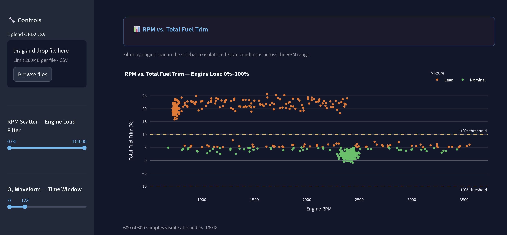
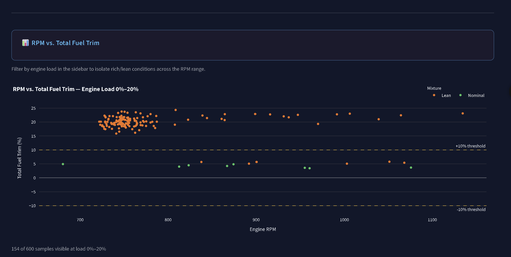
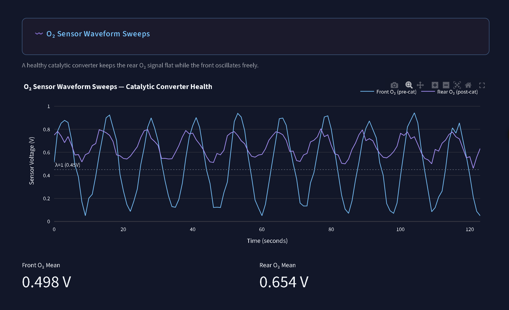
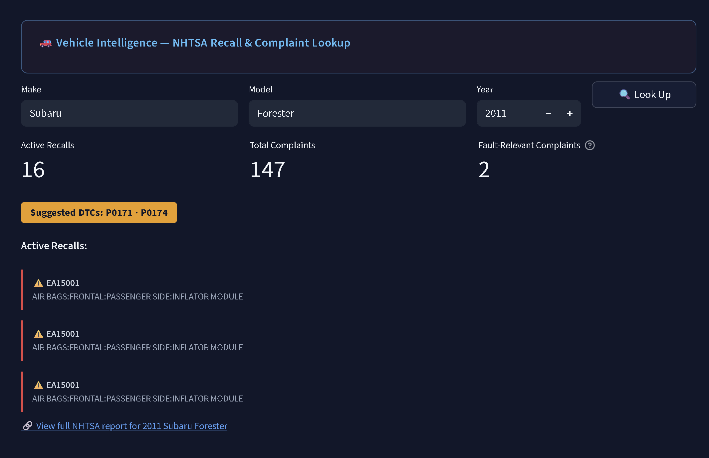
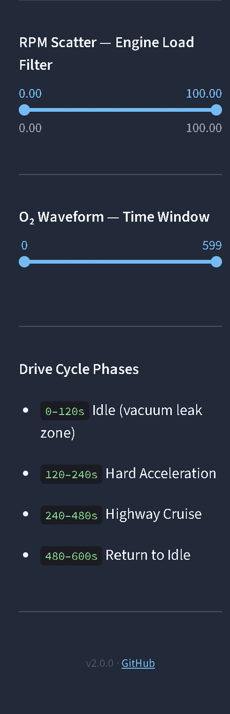

# OBD2 Engine Diagnostics Telemetry Lab

> Real-time automotive fault detection and NHTSA vehicle intelligence — built with Python, Streamlit, and Plotly.

[](https://engine-diagnostics-dashboard.streamlit.app)

---

## What It Does

Most dashboards visualize sales data or user metrics. This one visualizes the kind of data a mechanic reads from a $3,000 scan tool — and produces the same diagnostic conclusions in a browser, for free.

The dashboard ingests OBD2 automotive telemetry logs and answers three questions:

1. **Is this engine healthy?** — Fuel trim gauge with ±10% breach detection
2. **Where exactly does the fault appear?** — RPM vs. fuel trim scatter with engine load filtering
3. **Is the catalytic converter still working?** — O₂ sensor waveform comparison (front vs. rear)

And cross-references any detected fault against **live NHTSA government data** — recall counts, complaint volumes, and suggested diagnostic codes — for the specific vehicle entered.

---

## Screenshots

### RPM vs. Total Fuel Trim — Full Drive Cycle
*600 sensor readings across the full drive cycle. Orange = lean (above +10%), green = nominal. The vacuum leak signature is visible as the dense lean cluster at low RPM.*



---

### RPM Scatter — Idle Phase Isolated (0–20% Engine Load)
*Filter the load range to 0–20% and the vacuum leak pattern isolates immediately — virtually every idle reading sits above the +10% warning line. This is the diagnostic power of the load filter.*



---

### O₂ Sensor Waveform Sweeps — Catalytic Converter Health
*Front O₂ (blue) oscillates freely between 0.1V–0.9V. Rear O₂ (purple) follows with slight dampening — the signature of a still-functional but aging catalytic converter. Front mean: 0.498V. Rear mean: 0.654V.*



---

### NHTSA Vehicle Intelligence Panel
*Enter any make, model, and year. The panel pulls live NHTSA data — recall count, total complaints, fault-relevant complaints filtered to the detected fault direction, and suggested DTC codes. Here: 2011 Subaru Forester — 16 active recalls, 147 complaints, P0171/P0174 suggested for the lean fault.*



---

### Sidebar Controls
*Engine load filter slider (RPM scatter), O₂ time window slider, drive cycle phase legend with timestamps, and version/GitHub footer.*



---

## Features

### ⚡ Fuel Trim Diagnostic Gauge
- Sums STFT + LTFT into a **Total Fuel Trim** reading
- Fires a **FAULT / WARNING / NOMINAL** status badge automatically
- Flags lean (vacuum leak / unmetered air) vs. rich (over-fueling / injector leak)
- Shows % of drive cycle spent in warning zone

### 📊 RPM vs. Total Fuel Trim Scatter
- Every sensor reading plotted with mixture status coloring (Lean / Nominal / Rich)
- ±10% threshold reference lines
- **Live engine load filter** in sidebar — isolate idle, acceleration, or cruise zones

### 〰️ O₂ Sensor Waveform Sweeps
- Dual-line chart: front O₂ (pre-cat) vs. rear O₂ (post-cat)
- Stoichiometric reference at λ=1 (0.45V)
- **Time window slider** to zoom into any phase of the drive cycle
- Front/rear mean voltage metrics below the chart

### 🚗 NHTSA Vehicle Intelligence
- Enter any make, model, and year — **no API key required**
- Live recall count with component breakdown
- Complaint volume filtered to the detected fault direction
- Suggested DTC codes: P0171/P0174 (lean) or P0172/P0175 (rich)
- Direct link to the full NHTSA vehicle report

### 📁 File Upload
- Drag and drop your own OBD2 CSV — dashboard recalculates everything live
- Falls back to bundled sample dataset if no file is uploaded

---

## The Dataset

Engineered from scratch using `data/generate_dataset.py` — not a generic Kaggle CSV.

**600 samples at 1Hz across a realistic drive cycle:**

| Phase | Time | What Was Simulated |
|---|---|---|
| Idle | 0–120s | Vacuum leak — STFT +8%, LTFT +12% (total +20%) |
| Hard Acceleration | 120–240s | 750→3,500 RPM ramp, trims normalize under load |
| Highway Cruise | 240–480s | Stable 2,400 RPM, nominal trims |
| Return to Idle | 480–600s | Vacuum leak returns as manifold vacuum rises |

**Column schema:**

| Column | Unit | Description |
|---|---|---|
| `Timestamp_sec` | s | Elapsed time at 1Hz |
| `Engine_RPM` | RPM | Engine rotational speed |
| `Engine_Load_Pct` | % | Calculated engine load |
| `Mass_Air_Flow_g_s` | g/s | Mass air flow sensor |
| `Short_Term_Fuel_Trim_Pct` | % | ECU's immediate fuel correction |
| `Long_Term_Fuel_Trim_Pct` | % | ECU's learned long-term correction |
| `O2_Front_Volts` | V | Upstream O₂ sensor (pre-cat) |
| `O2_Rear_Volts` | V | Downstream O₂ sensor (post-cat) |

---

## Project Structure

```
engine-diagnostics-dashboard/
├── app.py                      # Streamlit entry point — layout and wiring only
├── data/
│   ├── generate_dataset.py     # Reproducible dataset generation script
│   └── engine_telemetry_log.csv
├── src/
│   ├── ingest.py               # CSV loading, schema validation, dtype enforcement
│   ├── transforms.py           # Total fuel trim calculation, mixture classification
│   ├── diagnostics.py          # ±10% threshold logic, alert messages, KPI aggregations
│   ├── charts.py               # Plotly chart builders (scatter + O₂ waveform)
│   ├── nhtsa.py                # NHTSA recall and complaint API (pure Python, no API key)
│   └── styles.py               # CSS design system — cards, badges, hero, NHTSA panel
├── screenshots/                # Dashboard screenshots for README
├── runtime.txt                 # Python 3.11 pin for Streamlit Cloud
├── requirements.txt            # Pinned dependencies
└── README.md
```

---

## Setup

```bash
git clone https://github.com/navneet-singh2907/engine-diagnostics-dashboard.git
cd engine-diagnostics-dashboard

python -m venv .venv
.venv\Scripts\activate        # Windows
source .venv/bin/activate     # macOS / Linux

pip install -r requirements.txt
streamlit run app.py
```

Open `http://localhost:8501`

To regenerate the dataset:
```bash
python data/generate_dataset.py
```

---

## Tech Stack

| Layer | Technology | Version |
|---|---|---|
| Dashboard | Streamlit | 1.35.0 |
| Data processing | pandas | 2.2.2 |
| Numerical | numpy | 1.26.4 |
| Visualisation | Plotly | 5.22.0 |
| External data | NHTSA API | Public, no key |
| Deployment | Streamlit Cloud | — |

---

## Git Branch Strategy

```
main          ← production releases only
  └── develop ← integration (all features merge here first)
        ├── feature/* ← one branch per feature
        └── fix/*     ← bug fixes and peer-review refactors
```

### Release History

| Version | What Shipped |
|---|---|
| v1.0.0 | Three-panel dashboard — fuel trim gauge, RPM scatter, O₂ waveform |
| v1.1.0 | Edge case hardening — 12 scenarios tested, 2 fixes applied |
| v2.0.0 | NHTSA Vehicle Intelligence, UI redesign, file upload, design system |

---

## Robustness — 18 Edge Cases Validated

### Bad CSV Inputs
| Scenario | Behaviour |
|---|---|
| Missing required column | `ValueError` with exact column name |
| Non-numeric values in sensor data | `ValueError` with row count |
| Empty CSV (headers only) | `ValueError: Telemetry file contains no data rows.` |
| Single data row | Loads and renders correctly |
| File not found | `FileNotFoundError` with full path |

### Sensor & UI Edge Cases
| Scenario | Behaviour |
|---|---|
| RPM = 0 (stalled engine) | Chart renders, all points at x=0 |
| Total fuel trim exactly at ±10% | Correctly treated as nominal |
| O₂ voltages outside 0–1V | Chart renders without crash |
| Load filter returns zero rows | Friendly warning shown, no crash |
| Time window collapsed to 1 second | O₂ chart renders 2 points |

### NHTSA & Upload Edge Cases
| Scenario | Behaviour |
|---|---|
| Unknown make/model | Returns empty lists, no crash |
| Nominal fault direction | No DTC codes suggested |
| NHTSA API unreachable | Dashboard stays live, panel shows graceful message |
| Upload wrong columns | `ValueError` with missing column names |
| Empty CSV upload | `ValueError` with clear message |
| Duplicate timestamps | All rows loaded, no crash |
| Out-of-order timestamps | Loads and renders correctly |

---

## Diagnostic Logic

```
Total Fuel Trim = STFT + LTFT

> +10%  →  LEAN   →  Vacuum leak / unmetered air  →  P0171, P0174
< -10%  →  RICH   →  Over-fueling / injector leak  →  P0172, P0175
±10%   →  NOMINAL
```

```
Front O₂ oscillates + Rear O₂ flat       =  Healthy catalytic converter
Front O₂ oscillates + Rear O₂ oscillates =  Cat failing or dead
```